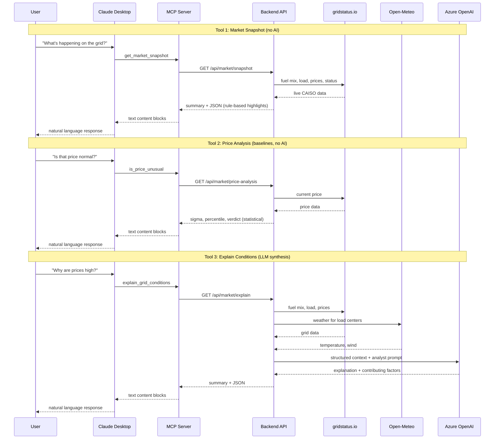

# GridStatus MCP Demo

A Model Context Protocol (MCP) server that provides real-time California electricity grid data to Claude Desktop. Built as a comprehensive showcase of MCP protocol primitives.

## How It Works

Four layers connect a user's question to live grid data:

1. **Claude Desktop** (host) — connects to the MCP server via stdio on launch. Discovers available tools, resources, and prompts. When the user asks a question, Claude decides which tools to call and synthesizes the results into a response.

2. **MCP Server** (TypeScript, this repo) — the protocol bridge. Translates MCP tool calls into REST API requests to the backend. Also serves static resources (CAISO overview) and prompt templates (grid briefing, price investigation) directly — no backend call needed.

3. **Backend API** (Python, FastAPI) — the data layer. Fetches live grid data from gridstatus.io, weather from Open-Meteo, computes statistical baselines, and calls Azure OpenAI when AI synthesis is needed.

4. **External services** — [gridstatus.io](https://gridstatus.io) for real-time CAISO data, [Open-Meteo](https://open-meteo.com) for weather, Azure OpenAI for LLM synthesis.

### Data flow by tool



### Under the hood

**Market Snapshot** — Fetches fuel mix, load, prices, and grid status from the gridstatus SDK. Generates highlights using domain rules (solar dominance at >30%, battery charging/discharging, gas reliance, price alerts). Pure data + rules, no AI.

**Price Analysis** — Gets the current average LMP and compares it against hardcoded hourly baselines (typical price for each hour of day) and a rolling 7-day statistical window. Returns standard deviations from mean (sigma), percentile rank, and a severity classification. Deterministic — same price at the same hour always produces the same verdict.

**Explain Conditions** — Gathers grid data from gridstatus *and* weather from Open-Meteo (Sacramento, LA, SF temperatures and wind speeds). Passes all of it as structured context to Azure OpenAI with an energy analyst persona prompt. The LLM synthesizes a multi-paragraph explanation with ranked contributing factors. This is the only tool that uses AI on the server side — Claude Desktop's own LLM is a *second* layer of AI that interprets the result for the user.

## Project Structure

```
backend/              FastAPI API — REST API for grid data
  routes/             Market snapshot, price analysis, AI explanation endpoints
  services/           gridstatus SDK, weather, baselines, OpenAI, caching
  config.py           Centralized env var configuration
  errors.py           Custom exceptions + centralized error handlers

mcp-server/           MCP server (TypeScript) — bridges Claude Desktop ↔ API
  src/index.ts        stdio transport (Claude Desktop)
  src/http.ts         Streamable HTTP transport with OAuth (port 3000)
  src/shared/         Tool, resource, and prompt definitions (shared by both transports)
  src/auth/           OAuth 2.1 server + AES-256-GCM token store
  start.sh            Auto-update wrapper for Claude Desktop
```

## Prerequisites

- Node.js 18+
- Python 3.11+
- A gridstatus.io API key
- Azure OpenAI endpoint (for the explain tool)

## Setup

### 1. Backend (FastAPI)

```bash
cd backend
pip install -r requirements.txt
# Set env vars: FOUNDRY_ENDPOINT, FOUNDRY_MODEL_DEPLOYMENT, MANAGED_IDENTITY_CLIENT_ID
uvicorn app:app --reload --port 8000
```

The API runs at `http://localhost:8000`.

### 2. MCP Server

```bash
cd mcp-server
npm install
npm run build
```

### 3. Connect to Claude Desktop

**For users (remote server):**

1. Open Claude Desktop → Settings → Connectors
2. Click "Add custom connector"
3. Paste the server URL: `https://ca-gridstatus-mcp.blacksmoke-21433aca.eastus2.azurecontainerapps.io/mcp`
4. A sign-in form opens in your browser — enter your gridstatus.io API key, or click **"Skip for now"** to explore public tools first
5. 3 tools are available immediately; a 4th premium tool unlocks when you sign in with a key

**For developers (local stdio):**

Add to `~/Library/Application Support/Claude/claude_desktop_config.json`:

```json
{
  "mcpServers": {
    "gridstatus-dev": {
      "command": "/absolute/path/to/gridstatus-demo/mcp-server/start.sh",
      "env": {
        "GRIDSTATUS_API_URL": "https://ca-gridstatus-api.blacksmoke-21433aca.eastus2.azurecontainerapps.io"
      }
    }
  }
}
```

Set `GRIDSTATUS_API_KEY` in the `env` section to unlock the 4th tool locally. Restart Claude Desktop after editing the config.

## Demo Script

Click the "+" icon in Claude Desktop → "Add from gridstatus" to see 4 options:

### 1. Prompts (User-Controlled Templates)

**Grid Briefing** (no args):
> Click it. Claude receives a pre-structured request to get the snapshot, check if price is unusual, and explain if needed. It chains all 3 tools automatically.

**Investigate Price** (takes ISO arg):
> Click it, enter "CAISO". Claude follows a structured investigation: check price → if unusual, explain why → if normal, summarize conditions.

**GridStatus Tutorial** (no args):
> Click it. Claude walks you through an interactive tour of all features — live data, price analysis, AI explanation, authentication, and more. Pauses between steps so you can try each tool yourself.

### 2. Resources (App-Controlled Context)

- **CAISO Grid Overview** — static reference data (price patterns, trading hubs, grid facts)
- **Live Grid Conditions** — fetches live snapshot from the API

Attach either resource to your conversation for context before asking questions.

### 3. Tools (Model-Controlled)

Type these into Claude Desktop:

**Tool 1 — Market Snapshot (no AI):**
> "What's happening on the California grid right now?"

Triggers `get_market_snapshot`. Returns prices, load, generation mix, highlights.

**Tool 2 — Price Analysis (deterministic baselines):**
> "Is that price normal?"

Triggers `is_price_unusual`. Returns sigma, percentile, severity, template verdict.

**Tool 3 — AI Explanation (LLM synthesis):**
> "Why are conditions like this?"

Triggers `explain_grid_conditions`. Returns multi-paragraph analyst explanation with contributing factors.

**Tool 4 — Historical Grid Data (requires API key):**
> "What were ERCOT prices last Tuesday?"

Triggers `query_grid_history`. Only available after authenticating via OAuth (or setting `GRIDSTATUS_API_KEY` env var for stdio). Covers all US ISOs: CAISO, ERCOT, PJM, MISO, NYISO, ISONE, SPP.

**Cross-tool chaining:**
> "Give me a full grid analysis"

Claude calls multiple tools because descriptions cross-reference each other (e.g., "If price looks high, follow up with is_price_unusual").

### 4. Logging

Check the MCP server logs:
```
~/Library/Logs/Claude/mcp-server-gridstatus.log
```

### 5. Progress Notifications

`explain_grid_conditions` sends progress notifications at each of 5 stages. Claude Desktop doesn't display these yet, but they're protocol-correct and visible in MCP Inspector.

### 6. Tool Annotations

All tools declare `readOnlyHint: true` and `openWorldHint: true` — safe (read-only) but making external network calls. Visible in `tools/list` response.

### 7. Completions

The resource template `gridstatus://{iso}/conditions` supports autocomplete on `iso`, returning `["CAISO"]`.

### 8. HTTP Transport

```bash
cd mcp-server && npm run start:http

curl -X POST http://localhost:3000/mcp \
  -H "Content-Type: application/json" \
  -d '{"jsonrpc":"2.0","id":1,"method":"initialize","params":{"protocolVersion":"2025-03-26","capabilities":{},"clientInfo":{"name":"curl","version":"1.0"}}}'
```

Same tools, resources, and prompts over HTTP instead of stdio.

## MCP Capability Coverage

| Capability | Implementation | Status |
|------------|---------------|--------|
| Tools | 3 public + 1 authenticated (unlocked after OAuth) | Working |
| Resources | Static overview + live dynamic template | Working |
| Prompts | 3 prompts: briefing, price investigation, interactive tutorial | Working |
| Logging | Info/error messages during tool execution | Working |
| Progress | 5-stage notifications on explain tool | Sent (host doesn't display yet) |
| Annotations | readOnlyHint + openWorldHint on all tools | Working |
| Completions | Autocomplete for resource template variables | Working |
| Transport: stdio | Claude Desktop entry point | Working |
| Transport: HTTP | Streamable HTTP on port 3000 | Working |
| OAuth 2.1 | PKCE + Dynamic Client Registration + token encryption | Working |

Additional MCP primitives (notifications, sampling, elicitation, tasks) are documented in [Capabilities](docs/capabilities.md) — deferred until client support matures.
