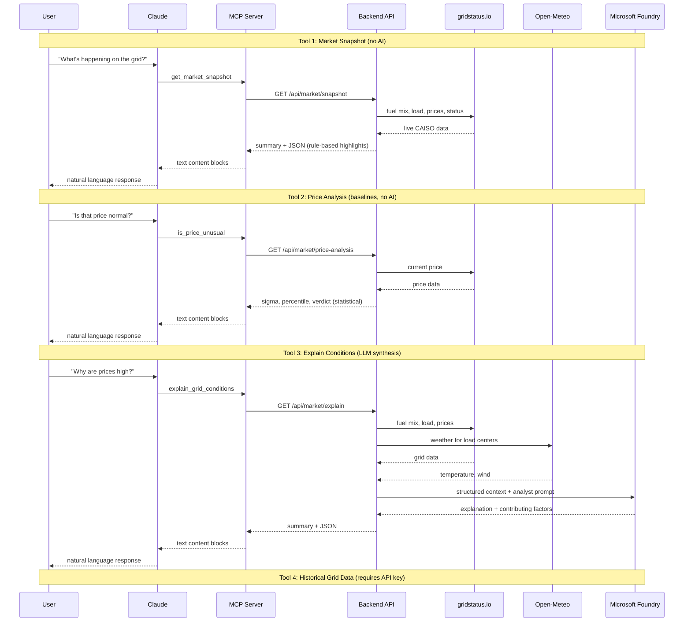

# GridStatus MCP Demo

A Model Context Protocol (MCP) server that provides real-time California electricity grid data to Claude. Built as a comprehensive showcase of MCP protocol primitives.

## Connect to Claude

**Server URL:**
```
https://ca-gridstatus-mcp.blacksmoke-21433aca.eastus2.azurecontainerapps.io/mcp
```

**Claude.ai or Claude Desktop (Pro/Max):**

1. Go to **Settings > Connectors > "Add custom connector"**
2. Paste the server URL above > **Add**
3. Click **Connect** — this opens the OAuth sign-in page
4. Enter your [gridstatus.io](https://gridstatus.io) API key, or click "Skip for now" to use the 3 public tools
5. Enable per conversation: click **"+" > Connectors** > toggle GridStatus on

**Teams/Enterprise:** An admin adds the connector in Organization settings > Connectors first, then members connect individually via Settings > Connectors.

**Note:** The backend runs on a scale-to-zero container to save cost. If the first connection attempt times out, just try again — the cold start takes a few seconds.

For full setup details, see [Getting started with custom connectors](https://support.claude.com/en/articles/11175166-getting-started-with-custom-connectors-using-remote-mcp).

### Other connection methods

**Extension bundle (.mcpb):** Download `gridstatus.mcpb` from the [latest release](https://github.com/fbomb111/gridstatus-mcp-demo/releases) and double-click to install in Claude Desktop.

**Local stdio (developer):** Add to `~/Library/Application Support/Claude/claude_desktop_config.json`:

```json
{
  "mcpServers": {
    "gridstatus-dev": {
      "command": "/absolute/path/to/gridstatus-demo/mcp-server/start.sh",
      "env": {
        "GRIDSTATUS_API_KEY": "your-key-here"
      }
    }
  }
}
```

## How It Works

Four layers connect a user's question to live grid data:

1. **Claude** (host) — connects to the MCP server, discovers available tools/resources/prompts, decides which tools to call, and synthesizes results into a response.

2. **MCP Server** (TypeScript) — the protocol bridge. Translates MCP tool calls into REST API requests. Also serves static resources and prompt templates directly.

3. **Backend API** (Python, FastAPI) — fetches live grid data from gridstatus.io, weather from Open-Meteo, computes statistical baselines, and calls Microsoft Foundry for AI synthesis.

4. **External services** — [gridstatus.io](https://gridstatus.io) for real-time CAISO data, [Open-Meteo](https://open-meteo.com) for weather, Microsoft Foundry for LLM synthesis.

### Tools

| Tool | What it does | AI involved? |
|------|-------------|--------------|
| **Market Snapshot** | Current prices, load, generation mix, rule-based highlights | No |
| **Price Analysis** | Statistical comparison against hourly baselines (sigma, percentile, severity) | No |
| **Explain Conditions** | Multi-paragraph analyst explanation with weather context | Yes (Foundry) |
| **Historical Data** | Query any US ISO's historical grid data (requires API key) | No |

### Data flow



## Project Structure

```
backend/              FastAPI API — REST API for grid data
  routes/             Market snapshot, price analysis, AI explanation endpoints
  services/           gridstatus SDK, weather, baselines, Foundry, caching
  config.py           Centralized env var configuration
  errors.py           Custom exceptions + centralized error handlers

mcp-server/           MCP server (TypeScript) — bridges Claude ↔ API
  src/index.ts        stdio transport (Claude Desktop)
  src/http.ts         Streamable HTTP transport with OAuth (port 3000)
  src/shared/         Tool, resource, and prompt definitions (shared by both transports)
  src/auth/           OAuth 2.1 server + AES-256-GCM token store
  start.sh            Auto-update wrapper for Claude Desktop
```

## Local Development

### Backend (FastAPI)

```bash
cd backend
pip install -r requirements.txt
# Set env vars: FOUNDRY_ENDPOINT, FOUNDRY_MODEL_DEPLOYMENT, MANAGED_IDENTITY_CLIENT_ID
uvicorn app:app --reload --port 8000
```

### MCP Server

```bash
cd mcp-server
npm install
npm run build
```

Build the extension from source:

```bash
cd mcp-server
bash scripts/build-mcpb.sh
# Produces gridstatus.mcpb — double-click to install
```

## Further Reading

- [Design Journey](docs/design_journey.md) — questions, tradeoffs, and decisions behind the project
- [Architecture](docs/architecture.md) — system design, data flows, infrastructure
- [Capabilities](docs/capabilities.md) — MCP primitives coverage and potential expansions
